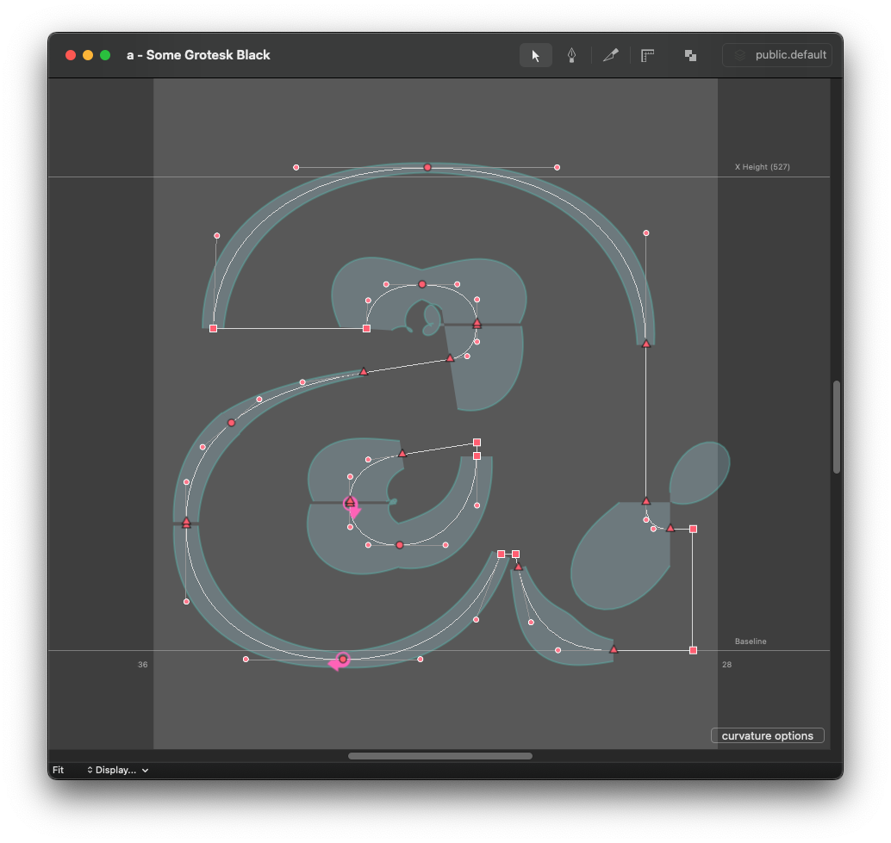
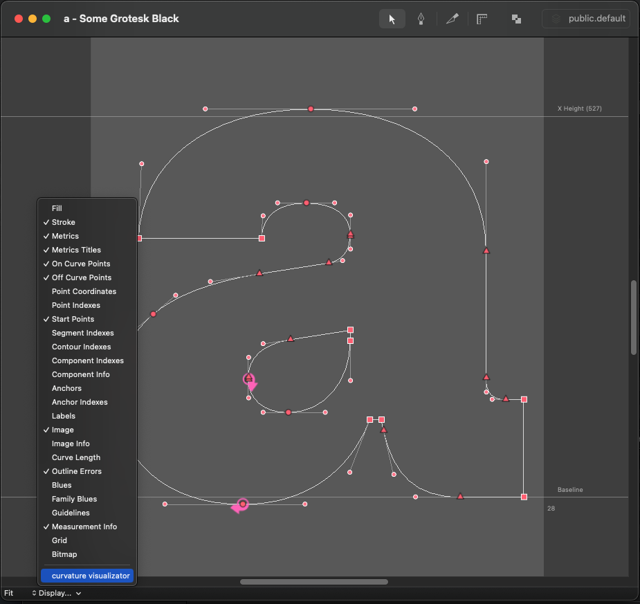

# Curvature Visualizator

I must give credit to the amazing  [`Primer on Bézier curves`](https://pomax.github.io/bezierinfo/) and [SpeedPunk](https://github.com/yanone/speedpunk), as they were instrumental in creating this repository. Although it may appear similar, the code is tailored specifically to its creator, making it more intuitive to use. Additionally, it only operates within the RoboFont environment, which simplifies the process. Thanks to this, incorporating support for quadratic curves was a straightforward task, unlike SpeedPunk, which currently lacks this feature.

## How does it work?

Basically, it adds a checkbox button to the `Display…` menu of the Glyph Edit Window.

All you need to do is activate it.

Additional options you will find in the `options` button that will appear in the bottom-right part of the Glyph Edit Window.

`Visualisation Size` controls how big the curvature representation is going to be.

`Visualisation Type` lets you decide which side of the outline will have its representation.

`Zoom visualisation` is a cool feature which will scale the whole curvature representation together with the zoom factor of your Glyph Edit Window.

More settings you will find in the `Extensions` > `Curvature Visualizator` > `Curvature Visualizator Settings` menu.

---

Maybe it is pointless, but I would like to share my opinion on the tools like these:
_Remember, this is no more and no less the tool. _
_You should always use your own judgement whenever you are creating. Making every curvature "smooth" without the slightest brainwork will probably reflect in boring or repetitive designs._
_You should know your tool; you should understand what it does. And I think you should control it and not let it control you. Have fun using it. :)_
